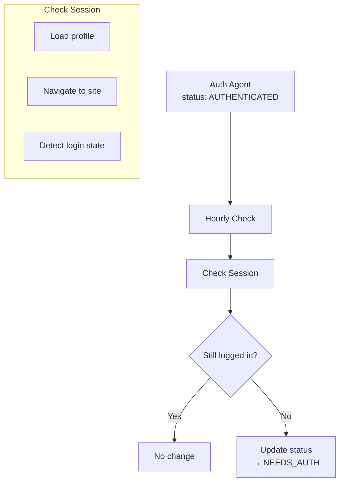

Agent Auth automatically monitors authenticated sessions to detect when they expire. This enables proactive re-authentication before your workflows fail.

## How Session Monitoring Works

Auth Agents with `AUTHENTICATED` status are automatically checked hourly to verify the session is still valid. The check:

1. Opens a browser with the authenticated profile
2. Navigates to the auth check URL (usually the main site)
3. Determines if the user is still logged in
4. Updates the Auth Agent status if the session has expired



## Detecting Expired Sessions

Check the Auth Agent status to determine if re-authentication is needed:

<CodeGroup>
```typescript TypeScript
import Kernel from '@onkernel/sdk';

const kernel = new Kernel();

async function checkAndRefreshAuth(agentId: string) {
  const agent = await kernel.agents.auth.retrieve(agentId);

  console.log('Status:', agent.status);
  console.log('Last check:', agent.last_auth_check_at);

  if (agent.status === 'NEEDS_AUTH') {
    console.log('Session expired - re-authentication needed');
    return await triggerReauth(agent);
  }

  console.log('Session is valid');
  return agent;
}
```

```python Python
from kernel import Kernel

kernel = Kernel()

async def check_and_refresh_auth(agent_id: str):
    agent = await kernel.agents.auth.retrieve(agent_id)

    print(f"Status: {agent.status}")
    print(f"Last check: {agent.last_auth_check_at}")

    if agent.status == "NEEDS_AUTH":
        print("Session expired - re-authentication needed")
        return await trigger_reauth(agent)

    print("Session is valid")
    return agent
```
</CodeGroup>

**Auth Agent status values:**

| Status | Description |
|--------|-------------|
| `AUTHENTICATED` | Session is valid and ready to use |
| `NEEDS_AUTH` | Session has expired, re-authentication required |

## Triggering Re-authentication

When a session expires, you have two options:

<Tip>
Check `agent.can_reauth` to determine which option is available. If `true`, automated re-auth is possible. If `false`, you'll need to redirect the user to complete login manually.
</Tip>

### Option 1: Automated Re-auth (Requires Credentials)

If the Auth Agent has linked credentials and saved selectors, trigger automated re-auth:

```typescript
async function triggerReauth(agent) {
  if (!agent.can_reauth) {
    console.log('Cannot auto-reauth - manual login required');
    // Fall back to hosted UI flow
    return await manualReauth(agent.id);
  }

  const reauth = await kernel.agents.auth.reauth(agent.id);

  switch (reauth.status) {
    case 'REAUTH_STARTED':
      console.log('Re-auth started:', reauth.invocation_id);
      // Poll for completion
      return await pollForCompletion(reauth.invocation_id);

    case 'ALREADY_AUTHENTICATED':
      console.log('Already authenticated');
      return { success: true };

    case 'CANNOT_REAUTH':
      console.log('Cannot reauth:', reauth.message);
      return await manualReauth(agent.id);
  }
}
```

### Option 2: Manual Re-auth (Hosted UI)

If credentials aren't stored, redirect the user to complete login:

```typescript
async function manualReauth(agentId: string) {
  const invocation = await kernel.agents.auth.invocations.create({
    auth_agent_id: agentId,
    save_credential_as: 'my-saved-creds', // Save for future auto-reauth
  });

  console.log('Redirect user to:', invocation.hosted_url);
  // User completes login...

  return await pollForCompletion(invocation.invocation_id);
}
```

## Polling for Re-auth Completion

After triggering re-auth, poll for completion:

```typescript
async function pollForCompletion(invocationId: string) {
  const maxWaitMs = 5 * 60 * 1000; // 5 minutes
  const startTime = Date.now();

  while (Date.now() - startTime < maxWaitMs) {
    const status = await kernel.agents.auth.invocations.retrieve(invocationId);

    if (status.status === 'SUCCESS') {
      console.log('Re-authentication successful!');
      return { success: true };
    }

    if (status.status === 'EXPIRED' || status.status === 'CANCELED') {
      console.log('Re-auth failed:', status.status);
      return { success: false, reason: status.status };
    }

    await new Promise(r => setTimeout(r, 2000));
  }

  return { success: false, reason: 'TIMEOUT' };
}
```

## Proactive Session Management

Instead of waiting for automations to fail, proactively check and refresh sessions:

```typescript
async function ensureAuthenticated(agentId: string) {
  const agent = await kernel.agents.auth.retrieve(agentId);

  // Already authenticated
  if (agent.status === 'AUTHENTICATED') {
    return agent;
  }

  // Need to re-auth
  if (agent.can_reauth) {
    const reauth = await kernel.agents.auth.reauth(agentId);
    if (reauth.status === 'REAUTH_STARTED') {
      await pollForCompletion(reauth.invocation_id);
    }
  } else {
    throw new Error('Session expired and cannot auto-reauth');
  }

  // Return refreshed agent
  return await kernel.agents.auth.retrieve(agentId);
}

// Use before running automations
async function runAutomation(agentId: string, profileName: string) {
  // Ensure authenticated before starting
  await ensureAuthenticated(agentId);

  // Create browser with authenticated profile
  const browser = await kernel.browsers.create({
    profile: { name: profileName },
    stealth: true,
  });

  // Run your automation...
}
```

## Monitoring Multiple Auth Agents

For applications with many authenticated sessions, batch-check auth status:

```typescript
async function checkAllSessions() {
  const agents = await kernel.agents.auth.list();
  const needsReauth = [];
  const canAutoReauth = [];
  const needsManualReauth = [];

  for (const agent of agents.items) {
    if (agent.status === 'NEEDS_AUTH') {
      needsReauth.push(agent);
      if (agent.can_reauth) {
        canAutoReauth.push(agent);
      } else {
        needsManualReauth.push(agent);
      }
    }
  }

  console.log(`Total agents: ${agents.items.length}`);
  console.log(`Needs re-auth: ${needsReauth.length}`);
  console.log(`Can auto-reauth: ${canAutoReauth.length}`);
  console.log(`Needs manual login: ${needsManualReauth.length}`);

  // Auto-reauth those that can be automated
  for (const agent of canAutoReauth) {
    await kernel.agents.auth.reauth(agent.id);
  }

  return { needsManualReauth };
}
```

## Complete Example: Robust Session Management

Here's a complete pattern for robust session handling:

```typescript
import Kernel from '@onkernel/sdk';

const kernel = new Kernel();

class AuthSessionManager {
  async getAuthenticatedBrowser(
    agentId: string,
    profileName: string,
    options?: { forceRefresh?: boolean }
  ) {
    // Check current status
    let agent = await kernel.agents.auth.retrieve(agentId);

    // Force refresh if requested
    if (options?.forceRefresh && agent.can_reauth) {
      await this.triggerReauth(agent);
      agent = await kernel.agents.auth.retrieve(agentId);
    }

    // Handle expired sessions
    if (agent.status === 'NEEDS_AUTH') {
      if (agent.can_reauth) {
        await this.triggerReauth(agent);
        agent = await kernel.agents.auth.retrieve(agentId);
      } else {
        throw new AuthRequiredError(
          'Session expired - manual login required',
          agentId
        );
      }
    }

    // Verify authentication succeeded
    if (agent.status !== 'AUTHENTICATED') {
      throw new AuthFailedError('Authentication failed', agentId);
    }

    // Create and return authenticated browser
    return await kernel.browsers.create({
      profile: { name: profileName },
      stealth: true,
    });
  }

  private async triggerReauth(agent: AuthAgent) {
    const reauth = await kernel.agents.auth.reauth(agent.id);

    if (reauth.status === 'REAUTH_STARTED' && reauth.invocation_id) {
      await this.pollForCompletion(reauth.invocation_id);
    } else if (reauth.status === 'CANNOT_REAUTH') {
      throw new CannotReauthError(reauth.message, agent.id);
    }
  }

  private async pollForCompletion(invocationId: string, timeoutMs = 300000) {
    const startTime = Date.now();

    while (Date.now() - startTime < timeoutMs) {
      const status = await kernel.agents.auth.invocations.retrieve(invocationId);

      if (status.status === 'SUCCESS') return;
      if (status.status === 'EXPIRED') throw new Error('Re-auth expired');
      if (status.status === 'CANCELED') throw new Error('Re-auth canceled');

      await new Promise(r => setTimeout(r, 2000));
    }

    throw new Error('Re-auth timeout');
  }
}

// Custom error types
class AuthRequiredError extends Error {
  constructor(message: string, public agentId: string) {
    super(message);
    this.name = 'AuthRequiredError';
  }
}

class AuthFailedError extends Error {
  constructor(message: string, public agentId: string) {
    super(message);
    this.name = 'AuthFailedError';
  }
}

class CannotReauthError extends Error {
  constructor(message: string, public agentId: string) {
    super(message);
    this.name = 'CannotReauthError';
  }
}

// Usage
const sessionManager = new AuthSessionManager();

try {
  const browser = await sessionManager.getAuthenticatedBrowser(
    'agent_abc123',
    'my-profile'
  );
  // Use the browser...
} catch (error) {
  if (error instanceof AuthRequiredError) {
    // Redirect user to complete login
    const invocation = await kernel.agents.auth.invocations.create({
      auth_agent_id: error.agentId,
    });
    console.log('Login required:', invocation.hosted_url);
  } else {
    throw error;
  }
}
```

## Best Practices

<AccordionGroup>
  <Accordion title="Check before automation">
    Always verify auth status before starting long-running automations. This prevents failures mid-workflow and allows you to handle re-authentication before it becomes blocking.
  </Accordion>
  <Accordion title="Enable auto-reauth">
    Store credentials to enable automated re-authentication. When sessions expire, the system can automatically log back in without user intervention.
  </Accordion>
  <Accordion title="Handle failures gracefully">
    Have a fallback to manual login when auto-reauth fails. Some sites may require CAPTCHA or additional verification that can't be automated.
  </Accordion>
  <Accordion title="Monitor auth status">
    Periodically check auth agents to proactively handle expirations. Don't wait for automations to fail—check status and refresh sessions ahead of time.
  </Accordion>
  <Accordion title="Log auth events">
    Track when re-auth happens for debugging and auditing. This helps identify patterns like which sites expire frequently or which users need attention.
  </Accordion>
</AccordionGroup>

## Session Check Frequency

<Info>
Auth checks run approximately **every hour** for authenticated agents. Checks are passive and don't modify the saved profile. Use the `last_auth_check_at` field to see when the last check occurred.
</Info>

## Next Steps

<CardGroup cols={2}>
  <Card title="Credentials" icon="key" href="/agent-auth/credentials">
    Store credentials to enable auto-reauth
  </Card>
  <Card title="Overview" icon="book" href="/agent-auth/overview">
    Review Agent Auth concepts
  </Card>
</CardGroup>
