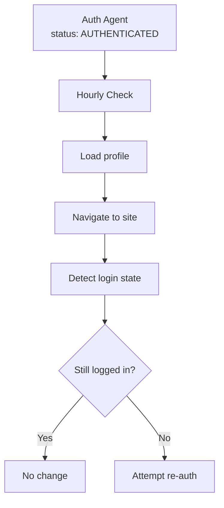

Agent Auth automatically monitors authenticated sessions to detect when they expire. This enables proactive re-authentication before your workflows fail.

## How It Works

Auth Agents with `AUTHENTICATED` status are automatically checked hourly to verify the session is still valid. The check:

1. Opens a browser with the authenticated profile
2. Navigates to the auth check URL (usually the main site)
3. Determines if the user is still logged in
4. If expired, attempts auto re-auth (if credentials are configured)



## What Happens When Sessions Expire

When a session expires, Agent Auth checks if the Auth Agent can automatically re-authenticate:

| Scenario | Outcome |
|----------|---------|
| Has credentials + saved selectors | Auto re-auth attempted. If successful, stays `AUTHENTICATED`. |
| Auto re-auth fails | Status changes to `NEEDS_AUTH` |
| No credentials or selectors | Status changes to `NEEDS_AUTH` |

### Enabling Auto Re-auth

To enable automatic re-authentication, you need:

1. **Linked credentials** - Stored login values for the target site
2. **Saved selectors** - Form selectors captured from a previous successful login

See [Credentials](/agents/auth/credentials) for setup details.

### Handling NEEDS_AUTH

When status is `NEEDS_AUTH`, auto re-auth either isn't configured or failed. You'll need to trigger a new login—this is the same flow as initial authentication:

- **[Hosted UI](/agents/auth/hosted-ui)** - Redirect user to complete login
- **[Auto-Login](/agents/auth/auto-login)** - Fully automated with pre-linked credentials

<Tip>
Use `save_credential_as` during login to store credentials. This enables automatic re-authentication for future session expirations.
</Tip>

## Checking Auth Status

Check the `status` and `last_auth_check_at` fields to see current state:

<CodeGroup>
```typescript TypeScript
const agent = await kernel.agents.auth.retrieve(agentId);

console.log('Status:', agent.status);           // AUTHENTICATED or NEEDS_AUTH
console.log('Last check:', agent.last_auth_check_at);
```

```python Python
agent = await kernel.agents.auth.retrieve(agent_id)

print(f"Status: {agent.status}")                # AUTHENTICATED or NEEDS_AUTH
print(f"Last check: {agent.last_auth_check_at}")
```
</CodeGroup>

| Status | Description |
|--------|-------------|
| `AUTHENTICATED` | Session is valid and ready to use |
| `NEEDS_AUTH` | Session expired and auto re-auth failed or isn't configured |

## Check Frequency

<Info>
Auth checks run approximately **every hour** for authenticated agents. Checks are passive and don't modify the saved profile unless re-authentication occurs.
</Info>

## Next Steps

<CardGroup cols={2}>
  <Card title="Credentials" icon="key" href="/agents/auth/credentials">
    Store credentials to enable auto re-auth
  </Card>
  <Card title="Hosted UI" icon="browser" href="/agents/auth/hosted-ui">
    Handle manual re-authentication
  </Card>
</CardGroup>
