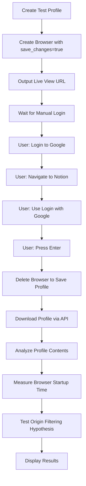

# Profile Loading Performance Testing Guide

## Overview

This guide documents the process and results of testing profile loading performance with Google login across multiple SaaS sites. The goal is to understand if large profiles (mega-profiles) cause slow browser startup times and whether origin filtering could improve performance.

## Background

Some customers use Kernel to manage multiple SaaS accounts by:
1. Creating a synthetic Google account
2. Logging into Google once in a browser
3. Using "Login with Google" across many SaaS products
4. Saving all this state in a single mega-profile
5. Reusing this profile across many sessions

This approach can result in very large profiles with hundreds of origins, thousands of cookies, and extensive localStorage/IndexedDB data. The question is: **Does this cause slow browser startup times?**

## Test Setup

### Prerequisites

1. **Kernel API Key**: Set `KERNEL_API_KEY` environment variable
2. **Google Account**: A test Google account for logging in
3. **Node.js/Bun**: To run the test script
4. **Access to Live View**: To manually perform login steps

### Running the Test

```bash
cd kernel/packages/synthetic-tests
export KERNEL_API_KEY="your-api-key"
bun run src/profile-load-test.ts
```

Or with npm/pnpm:

```bash
npm run dev src/profile-load-test.ts
# or
pnpm tsx src/profile-load-test.ts
```

## Test Workflow

The automated test script performs the following steps:



### Manual Steps During Test

When the test pauses, you need to:

1. **Open the Live View URL** displayed in the terminal
2. **Navigate to Google**: Go to `https://accounts.google.com`
3. **Login**: Enter your test Google account credentials
4. **Navigate to Notion**: Go to `https://www.notion.so`
5. **Use "Login with Google"**: Click the button to authenticate
6. **Wait for Notion to load**: Ensure you're fully logged in
7. **Press Enter** in the terminal to continue

## Metrics Collected

### Profile Analysis

The test analyzes the downloaded profile and reports:

- **Total Size**: Profile JSON size in KB and bytes
- **Cookie Count**: Total number of cookies across all domains
- **Origin Count**: Number of unique origins with stored data
- **Top Origins by Cookies**: The 10 origins with the most cookies
- **Top Origins by LocalStorage**: The 10 origins with the most localStorage entries
- **Domain Breakdown**: Cookies, localStorage, and IndexedDB counts per domain

### Timing Measurements

The test measures browser startup time with the profile loaded:

- **Browser Creation Time**: Time from API call to browser ready
- **Navigation Time**: Time to navigate to Notion after browser is ready
- **Total Time**: Combined time for full browser startup
- **Statistics**: Average, median, min, max across multiple iterations (default: 3)

### Origin Filtering Analysis

The test analyzes potential benefits of origin filtering:

- **Google-related origins**: Count and percentage of total
- **Notion-related origins**: Count and percentage of total
- **Minimal profile size**: Size if only Google + Notion origins were loaded
- **Size reduction**: Percentage reduction from filtering

## Interpreting Results

### Profile Size

- **< 100 KB**: Small profile, unlikely to cause performance issues
- **100 KB - 1 MB**: Medium profile, may have minor impact
- **1 MB - 10 MB**: Large profile, likely to impact startup time
- **> 10 MB**: Mega-profile, significant performance impact expected

### Browser Startup Time

- **< 5 seconds**: Fast startup, no optimization needed
- **5-10 seconds**: Moderate startup, optimization may help
- **10-30 seconds**: Slow startup, optimization recommended
- **> 30 seconds**: Very slow, optimization critical

### Origin Filtering Potential

If the minimal profile (Google + target site only) is significantly smaller than the full profile:

- **> 50% reduction**: Strong candidate for origin filtering
- **25-50% reduction**: Moderate benefit from filtering
- **< 25% reduction**: Limited benefit, may not be worth complexity

## Example Results

### Sample Output

```
📊 PROFILE ANALYSIS
======================================================================
📦 Total Size: 2,456.78 KB (2515712 bytes)
🍪 Total Cookies: 847
🌐 Total Origins: 156

🔝 Top 10 Origins by Cookie Count:
   1. https://.google.com: 234 cookies
   2. https://.notion.so: 45 cookies
   3. https://.gstatic.com: 38 cookies
   ...

⏱️  TIMING STATISTICS
======================================================================
📊 Average: 12,345.67ms
📊 Median: 12,234.00ms
📊 Min: 11,890ms
📊 Max: 13,012ms
📊 Range: 1,122ms

🔍 ORIGIN FILTERING ANALYSIS
======================================================================
📊 Google-related origins: 23 (14.7%)
📊 Notion-related origins: 8 (5.1%)
📊 Google-related cookies: 234 (27.6%)
📊 Notion-related cookies: 45 (5.3%)

💡 Minimal profile size (Google + Notion only): 345.67 KB
💡 Size reduction: 85.9% (from 2,456.78 KB to 345.67 KB)
```

### Interpretation

In this example:
- The profile is quite large (2.5 MB)
- Browser startup takes ~12 seconds on average
- Origin filtering could reduce size by 86%
- **Recommendation**: Implement origin filtering for this use case

## Origin Filtering Implementation Approach

If testing confirms that origin filtering would help, here's the recommended approach:

### 1. Add API Parameter

Add an optional `origins` parameter to the browser creation API:

```typescript
await kernel.browsers.create({
  profile: {
    name: 'my-profile',
    origins: ['google.com', 'notion.so'], // Only load these origins
  },
});
```

### 2. Filter Profile Data

In `kernel/packages/api/lib/profiles/service_cdp.go`, modify `LoadProfileIntoSession`:

```go
// Filter cookies by allowed origins
filteredCookies := state.Cookies
if len(allowedOrigins) > 0 {
    filteredCookies = filterCookiesByOrigins(state.Cookies, allowedOrigins)
}

// Filter origins by allowed list
filteredOrigins := state.Origins
if len(allowedOrigins) > 0 {
    filteredOrigins = filterOriginsByList(state.Origins, allowedOrigins)
}
```

### 3. Domain Matching Logic

Support flexible domain matching:
- `google.com` matches `.google.com`, `accounts.google.com`, etc.
- `notion.so` matches `.notion.so`, `www.notion.so`, etc.

### 4. Performance Testing

After implementation:
1. Run the same test with origin filtering enabled
2. Compare startup times with and without filtering
3. Verify login functionality still works
4. Document performance improvements

## Troubleshooting

### Profile Not Saving

**Issue**: Profile appears empty after saving

**Solution**:
- Ensure `save_changes: true` is set when creating the browser
- Wait at least 5 seconds after deleting the browser before downloading
- Check that you actually logged in and created session state

### Browser Startup Timeout

**Issue**: Browser creation times out when loading profile

**Solution**:
- Profile may be too large (> 10 MB)
- Try with a smaller profile first
- Check Kernel logs for specific errors
- Increase timeout if necessary

### Download Fails

**Issue**: Profile download returns 404 or empty data

**Solution**:
- Profile may not have any saved data yet
- Verify profile exists: `kernel.profiles.list()`
- Check that browser was deleted (not just closed)
- Wait longer for profile persistence

## Next Steps

After running the test:

1. **Document your results** in this file under a "Test Results" section
2. **Share findings** with the team
3. **Decide on implementation** of origin filtering if beneficial
4. **Create follow-up tests** for other SaaS sites if needed

## Test Results

### Test Run: [Date]

**Tester**: [Your Name]

**Profile Details**:
- Size: X KB
- Cookies: X
- Origins: X

**Timing Results**:
- Average startup: X ms
- Median startup: X ms
- Range: X ms

**Origin Filtering Analysis**:
- Potential size reduction: X%
- Google origins: X
- Notion origins: X

**Recommendation**:
[Your recommendation based on results]

**Notes**:
[Any additional observations]

---

## References

- [Kernel Profiles Documentation](/browsers/profiles)
- [Profile API Reference](/api-reference/profiles/list-profiles)
- [Browser Creation API](/api-reference/browsers/create-a-browser)

